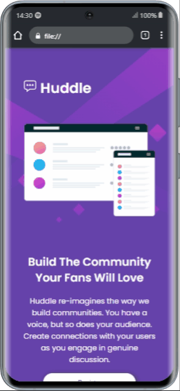

<h1 align='center'>Landing Page</h1>

 
 

  
   

# Índice

- [Descrição do Projeto](#descrição-do-projeto)
- [Tecnologias utilizadas](#tecnologias-utilizadas)
- [Autor](#author)

# Descrição do Projeto

Uma Landing Page simples  de maneira responsiva com o uso de Grid e Flexbox.

obs: projeto original no <a href="https://www.frontendmentor.io/challenges/huddle-landing-page-with-a-single-introductory-section-B_2Wvxgi0"> site </a>

 # Tecnologias utilizadas
 - HTML e CSS
- Git e Github

# Autor
 Paloma Santos Ferreira 